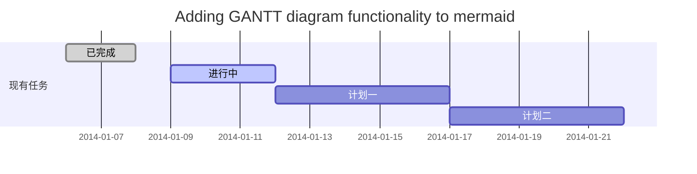
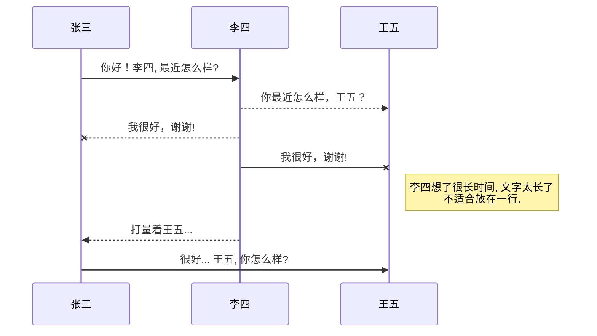
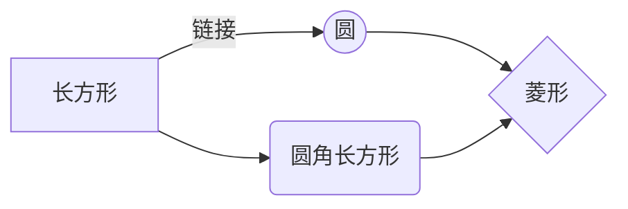

# 0121. 买卖股票的最佳时机

​
**题目内容：** 

给定一个数组 prices ，它的第 i 个元素 prices[i] 表示一支给定股票第 i 天的价格。

你只能选择 某一天 买入这只股票，并选择在 未来的某一个不同的日子 卖出该股票。设计一个算法来计算你所能获取的最大利润。

返回你可以从这笔交易中获取的最大利润。如果你不能获取任何利润，返回 0 。

示例 1：
输入：[7,1,5,3,6,4]
输出：5
解释：在第 2 天（股票价格 = 1）的时候买入，在第 5 天（股票价格 = 6）的时候卖出，最大利润 = 6-1 = 5 。注意利润不能是 7-1 = 6, 因为卖出价格需要大于买入价格；同时，你不能在买入前卖出股票。

这说明只能买入一次，卖出一次，切记。

疑问：这里主要是用贪心算法和动态规划算法没能正确做出来。

## 解法1：暴力算法

该方法超时了哈。

```cpp
class Solution {
public:
	int maxProfit(vector<int>& prices) {
        int result = 0;
        int sum=0;
        for (int i = 0; i < prices.size()-1; i++) {
                //获取从下标[i+1, prices.size()-1]范围内的最大值
                sum=*std::max_element(prices.begin()+i+1,prices.end())-prices[i];
                result=max(result,sum);        //接着逐次比较，取最大值
            }
        }
        return result;
    }
};
```


## 解法2：贪心算法

之前想的是如何找到左最小值，可是就不知该怎么写代码，

直接看代码吧。

这句代码 low=min(low,prices[i]);解答了我的不知该怎么写代码的困惑。。

```cpp
class Solution {
public:
    int maxProfit(vector<int>& prices) {
        int result = 0;
        int low=0;
        
        int n=prices.size();
        for(int i=0;i<n;++i){
            low=min(low,prices[i]);//这里是保存走到下标为i为止的最小值，这样就可以是找到左侧最小值
            //（当前下标元素-保存走到下标为i为止的最小值）与result做比较
            result=max(prices[i]-low,result);
        }
    }
};
```


## 解法3：动态规划

用了数组dp[n],一开始用了一维数组，没有想到二维数组，用来表示两种状态：持有股票，不持有股票。

所以需要用二维数组vector<int> dp(n,vector<int>(2));

按照《代码随想录》的动态五步曲做法：

1.确定数组dp及其下标的含义

dp[i][0]表示第i天持有股票的所得的最多现金。

这里要解决的困惑：那第0天一开始就买入股票，那持有股票所得的最多现金是多少呢？一开是现金是0，那买入股票后，那持有的现金就是0-prices[0];这是为了配合数组的含义。

还有一点：买入和持有是有区别的，持有状态可以是当天买入就表示持有状态，也可以在前一天买入，当天不操作，那当天也是持有状态的。

dp[i][1]表示第i天不持有股票所得的最多现金。

2.分析出递推公式

第i天持有股票:可由两个状态推导出来

1）可维持前一天的持有状态

2）可由前一天是不持有状态，当天买入股票；因为买入股票只能买入一次，所以当天买买入的话，那之前都是没有买入过的（数组含义持有或不持有股票所得的最多现金，那买入股票，所以是要减去当前的股票价钱 ）

dp[i][0]=max(dp[i-1][0],-prices[i]);

第i天不持有股票：

1）可维持前一天的不持有状态

2）前一天持有股票的，当天就卖出股票

dp[i][1]=max(dp[i-1][1],dp[i-1][0]+prices[i]);

3.dp数组初始化

由递推公式dp[i][0]=max(dp[i-1][0],-prices[i])可知，需要从 dp[0][0] 和 dp[0][1] 推导出来。

当天持有股票，因为是第一天，那肯定是买入的，所以dp[0][0]=-prices[0];

当天不持有股票，因为是第一天，那没有买入也没卖出，所以dp[0][1]=0;

4.确定遍历顺序

从递推公式可以看出dp[i][0]是有从dp[i-1][0]这些推导出来的，所以是从前往后遍历。

5.举例推导数组

这里是为了验证的，当提交答案错误时，可以去打印dp数组去查看是哪出错的。


```cpp
class Solution {
public:
    int maxProfit(vector<int>& prices) {
        int len = prices.size();
        if (len == 0) return 0;
        vector<vector<int>> dp(len, vector<int>(2));
        dp[0][0] -= prices[0];
        dp[0][1] = 0;
        for (int i = 1; i < len; i++) {
            dp[i][0] = max(dp[i - 1][0], -prices[i]);
            dp[i][1] = max(dp[i - 1][1], prices[i] + dp[i - 1][0]);
        }

        //答案是dp[len-1][1],因为最终不持有股票那肯定是获得的钱最多的
        return dp[len - 1][1];
    }
};
```

这题之前也是做过的了，就是再次做到，也有点没想法，贪心的不知怎么写，而动态规划的没想到用二维数组来表示两种状态。

​
# 欢迎使用Markdown编辑器

你好！ 这是你第一次使用 **Markdown编辑器** 所展示的欢迎页。如果你想学习如何使用Markdown编辑器, 可以仔细阅读这篇文章，了解一下Markdown的基本语法知识。

## 新的改变

我们对Markdown编辑器进行了一些功能拓展与语法支持，除了标准的Markdown编辑器功能，我们增加了如下几点新功能，帮助你用它写博客：
 1. **全新的界面设计** ，将会带来全新的写作体验；
 2. 在创作中心设置你喜爱的代码高亮样式，Markdown **将代码片显示选择的高亮样式** 进行展示；
 3. 增加了 **图片拖拽** 功能，你可以将本地的图片直接拖拽到编辑区域直接展示；
 4. 全新的 **KaTeX数学公式** 语法；
 5. 增加了支持**甘特图的mermaid语法[^1]** 功能；
 6. 增加了 **多屏幕编辑** Markdown文章功能；
 7. 增加了 **焦点写作模式、预览模式、简洁写作模式、左右区域同步滚轮设置** 等功能，功能按钮位于编辑区域与预览区域中间；
 8. 增加了 **检查列表** 功能。
 [^1]: [mermaid语法说明](https://mermaidjs.github.io/)

## 功能快捷键

撤销：<kbd>Ctrl/Command</kbd> + <kbd>Z</kbd>
重做：<kbd>Ctrl/Command</kbd> + <kbd>Y</kbd>
加粗：<kbd>Ctrl/Command</kbd> + <kbd>B</kbd>
斜体：<kbd>Ctrl/Command</kbd> + <kbd>I</kbd>
标题：<kbd>Ctrl/Command</kbd> + <kbd>Shift</kbd> + <kbd>H</kbd>
无序列表：<kbd>Ctrl/Command</kbd> + <kbd>Shift</kbd> + <kbd>U</kbd>
有序列表：<kbd>Ctrl/Command</kbd> + <kbd>Shift</kbd> + <kbd>O</kbd>
检查列表：<kbd>Ctrl/Command</kbd> + <kbd>Shift</kbd> + <kbd>C</kbd>
插入代码：<kbd>Ctrl/Command</kbd> + <kbd>Shift</kbd> + <kbd>K</kbd>
插入链接：<kbd>Ctrl/Command</kbd> + <kbd>Shift</kbd> + <kbd>L</kbd>
插入图片：<kbd>Ctrl/Command</kbd> + <kbd>Shift</kbd> + <kbd>G</kbd>
查找：<kbd>Ctrl/Command</kbd> + <kbd>F</kbd>
替换：<kbd>Ctrl/Command</kbd> + <kbd>G</kbd>

## 合理的创建标题，有助于目录的生成

直接输入1次<kbd>#</kbd>，并按下<kbd>space</kbd>后，将生成1级标题。
输入2次<kbd>#</kbd>，并按下<kbd>space</kbd>后，将生成2级标题。
以此类推，我们支持6级标题。有助于使用`TOC`语法后生成一个完美的目录。

## 如何改变文本的样式

*强调文本* _强调文本_

**加粗文本** __加粗文本__

==标记文本==

~~删除文本~~

> 引用文本

H~2~O is是液体。

2^10^ 运算结果是 1024.

## 插入链接与图片

链接: [link](https://www.csdn.net/).

图片: 

带尺寸的图片: 

居中的图片: 

居中并且带尺寸的图片: 

当然，我们为了让用户更加便捷，我们增加了图片拖拽功能。

## 如何插入一段漂亮的代码片

去[博客设置](https://mp.csdn.net/console/configBlog)页面，选择一款你喜欢的代码片高亮样式，下面展示同样高亮的 `代码片`.
```javascript
// An highlighted block
var foo = 'bar';
```

## 生成一个适合你的列表

- 项目
  - 项目
    - 项目

1. 项目1
2. 项目2
3. 项目3

- [ ] 计划任务
- [x] 完成任务

## 创建一个表格
一个简单的表格是这么创建的：
项目     | Value
-------- | -----
电脑  | $1600
手机  | $12
导管  | $1

### 设定内容居中、居左、居右
使用`:---------:`居中
使用`:----------`居左
使用`----------:`居右
| 第一列       | 第二列         | 第三列        |
|:-----------:| -------------:|:-------------|
| 第一列文本居中 | 第二列文本居右  | 第三列文本居左 |

### SmartyPants
SmartyPants将ASCII标点字符转换为“智能”印刷标点HTML实体。例如：
|    TYPE   |ASCII                          |HTML
|----------------|-------------------------------|-----------------------------|
|Single backticks|`'Isn't this fun?'`            |'Isn't this fun?'            |
|Quotes          |`"Isn't this fun?"`            |"Isn't this fun?"            |
|Dashes          |`-- is en-dash, --- is em-dash`|-- is en-dash, --- is em-dash|

## 创建一个自定义列表
Markdown
:  Text-to-HTML conversion tool

Authors
:  John
:  Luke

## 如何创建一个注脚

一个具有注脚的文本。[^2]

[^2]: 注脚的解释

##  注释也是必不可少的

Markdown将文本转换为 HTML。

*[HTML]:   超文本标记语言

## KaTeX数学公式

您可以使用渲染LaTeX数学表达式 [KaTeX](https://khan.github.io/KaTeX/):

Gamma公式展示 $\Gamma(n) = (n-1)!\quad\forall
n\in\mathbb N$ 是通过欧拉积分

$$
\Gamma(z) = \int_0^\infty t^{z-1}e^{-t}dt\,.
$$

> 你可以找到更多关于的信息 **LaTeX** 数学表达式[here][1].

## 新的甘特图功能，丰富你的文章


- 关于 **甘特图** 语法，参考 [这儿][2],

## UML 图表

可以使用UML图表进行渲染。 [Mermaid](https://mermaidjs.github.io/). 例如下面产生的一个序列图：



这将产生一个流程图。:



- 关于 **Mermaid** 语法，参考 [这儿][3],

## FLowchart流程图

我们依旧会支持flowchart的流程图：
```mermaid
flowchat
st=>start: 开始
e=>end: 结束
op=>operation: 我的操作
cond=>condition: 确认？

st->op->cond
cond(yes)->e
cond(no)->op
```

- 关于 **Flowchart流程图** 语法，参考 [这儿][4].

## 导出与导入

###  导出
如果你想尝试使用此编辑器, 你可以在此篇文章任意编辑。当你完成了一篇文章的写作, 在上方工具栏找到 **文章导出** ，生成一个.md文件或者.html文件进行本地保存。

### 导入
如果你想加载一篇你写过的.md文件，在上方工具栏可以选择导入功能进行对应扩展名的文件导入，
继续你的创作。

 [1]: http://meta.math.stackexchange.com/questions/5020/mathjax-basic-tutorial-and-quick-reference
 [2]: https://mermaidjs.github.io/
 [3]: https://mermaidjs.github.io/
 [4]: http://adrai.github.io/flowchart.js/
